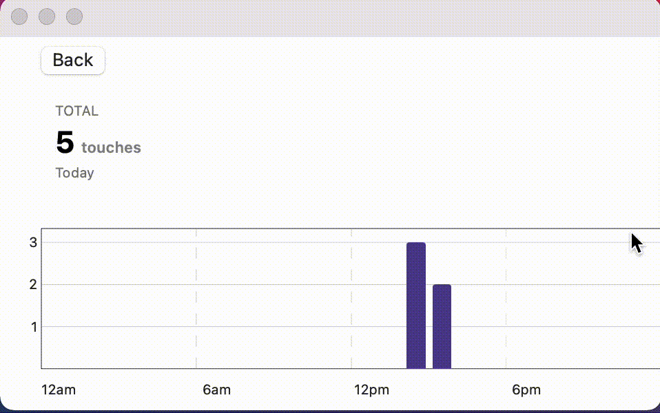

# NoTouch

NoTouch is a Mac, iPhone, and iPad app that uses the front facing camera and machine learning to alert a user if they are touching their face. The app is built with SwiftUI. CloudKit is integrated to securely track the number of times a user touches their face. A custom graph visualization of this CloudKit data, written in SwiftUI, is also included in the app.

Built and tested with:
- macOS 11.1
- Xcode 12.3

To run, open `NoTouch.xcworkspace`, select your target, and run!
